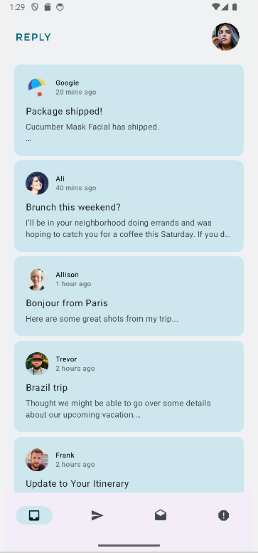
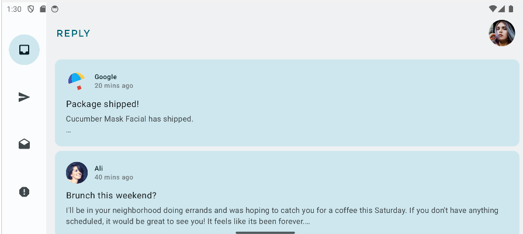
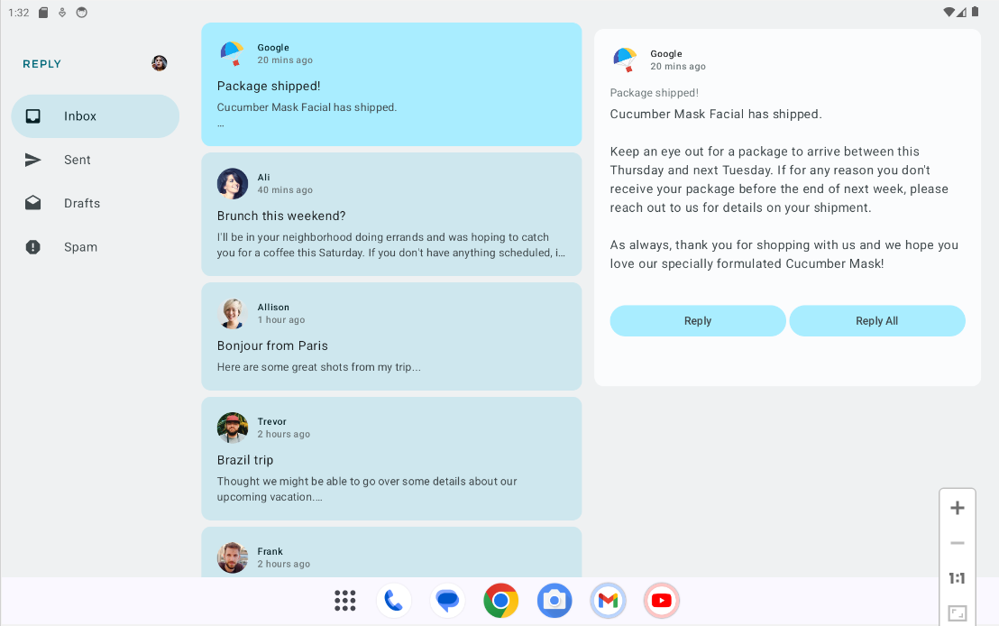

# 📧 **Reply**
**Reply** is a modern Android application that simulates an email client. It lets you view, organize, and interact with emails using Android development best practices, including Jetpack Compose and an MVVM architecture.

## 📋 **Features**
   - 📂 **Mailbox browsing**:
      - Access different categories: Inbox, Drafts, Sent, Spam.
      - Easily change categories via a Navigation Rail, Navigation Drawer and Bottom Navigation Bar (depending on hardware screen size).
   - ✉️ **Email list**:
      - View the list of emails associated with each inbox.
      - Select an email to view its contents in detail.
   - 📜 **Email details**:
      - View an email's information: sender, recipients, subject, message body, date sent.
   - 🎨 **Modern, fluid interface**:
      - Use of Jetpack Compose for a declarative interface.
      - Material 3 integration for accessible, modern design.
      - Support for dark and light themes.
      - Use of windowSizeClass to display a better user interface depending on screen size.

## 🛠️ **Tech Stack**:
   - **Kotlin: Modern**, concise language for Android development.
   - **Jetpack Compose**: Declarative UI toolkit for Android.
   - **Material 3**: Modern, accessible user interface.
   - **StateFlow**: Reactive state management for real-time updates.
   - **ViewModel**: MVVM architecture to separate business logic from user interface.

## 📦 **Project Structure**
**Packages**:
1. **Data**:
   - Defines data models for emails and user accounts:
      - **MailboxType**: Enum for different email categories (Inbox, Drafts, etc.).
      - **Email**: Data model to represent an email.
      - **Account**: Data model to represent a user account.
2. **data.local**:
   - Provides static data to simulate user accounts and emails:
      - **LocalAccountsDataProvider**: Contains fictitious user accounts.
      - **LocalEmailsDataProvider**: Contains the list of fictitious emails.
3. **Ui**:
   - Implements the user interface using Jetpack Compose:
      - **ReplyApp**: application's main entry point.
      - **ReplyHomeScreen**: Manages navigation and display of email lists.
      - **ReplyDetailsScreen**: Displays the details of a selected email.
4. **AndroidTest**:
   - **ReplyAppTest**: Ensures the correct navigation type (Navigation Rail, Navigation Drawer, or Bottom Navigation Bar) is displayed depending on the screen size.
   - **ReplyAppStateRestorationTest**: Verifies that the selected email remains visible after a configuration change (e.g., screen rotation) in different modes (compact, expanded).

## 🧪 **Testing**
The application is tested using Jetpack Compose UI Test with the following categories:
   - **Navigation Tests**:
      - **Compact Mode**: Verifies that the Bottom Navigation Bar is displayed on compact devices.
      - **Medium Mode**: Verifies that the Navigation Rail is displayed on medium-sized devices.
      - **Expanded Mode**: Verifies that the Navigation Drawer is displayed on large devices.
   - **State Restoration Tests**:
      - **Compact Mode**: Ensures the selected email remains displayed after a configuration change (e.g., screen rotation).
      - **Expanded Mode**: Verifies that an email displayed in the details screen remains visible after a configuration change.
   - **Custom Test Extensions**: The project includes custom test utility extensions for convenience:
      - **onNodeWithStringId**: Locates a node by its string resource ID.
      - **onNodeWithContentDescriptionForStringId**: Locates a node by its content description defined as a string resource.
      - **onNodeWithTagForStringId**: Locates a node by its label.

## 🚀 **How to Use**
1. **Launch the App**:
   - Open the app on a Android device or emulator.
2. **Navigate between categories**:
   - Use the Navigation Rail, the bottom navigation bar, or the Navigation Drawer to access different mailboxes.
3. **View an email**:
   - Tap an email in the list to see its details.
4. **Perform actions**:
   - Reply, continue writing, or delete depending on the email category.

## 📸 **Screenshots**
- **Smartphone in portait**:

   

- **Smartphone in landscape**:

   

- **Tablet**:

   